# Youth-Sakti-Social-Foundation

> 🚀 **Interactive & Animated Architecture Visualizer**: View the fully animated, interactive workflows and system graphs directly on the live platform! Navigate to `/system-design` on the running application to experience the live request flow simulator, interactive tech stack deck, database ER visualizer, and build pipelines in action.

## NGO Website — Finalized Modern Tech Stack

### Project Architecture Overview


| Category | Technology | Purpose / Usage |
|---|---|---|
| Frontend Framework | Next.js 16 (TypeScript) | Main frontend framework for dynamic page rendering and routing |
| UI Library | React.js 19 | Component-based UI development |
| Styling | Tailwind CSS v4 | Utility-first responsive styling system |
| Animation | Framer Motion 12 | Smooth UI animations, page transitions, and timeline micro-interactions |
| Backend Framework | Express.js 5 | Robust backend server handling REST APIs and authentication routing |
| Authentication | Custom JWT Auth (jose) | Secure token-based session management, cookies, and roles (Admin/Volunteer/Donor) |
| Database | SQLite (better-sqlite3) | Serverless relational database for local development and production |
| ORM | Prisma 7 | Schema management, type-safe queries, database adapters, and migration configurations |
| State Management | React Context | Native React Context (`AuthContext`) for tracking active sessions |
| File & Media Storage | Static Public Assets | Fast local hosting for campaign and gallery media files |
| Payment Gateway | Simulated Sandbox Integration | Dynamic simulation processing and recording donations in SQLite database |
| Language | TypeScript | Strict type safety, interface verification, and contract types |
| Version Control | Git + GitHub | Source code management and collaborative versioning |
| API Communication | Typed REST API Client (`api.ts`) | Unified frontend-backend integration with custom CORS and authentication interceptors |
| Containerization | Docker & docker-compose | Multi-stage container builds and orchestrated service runners |

---

# Technology Usage Breakdown

## Frontend Layer

| Tool | Where It Will Be Used |
|---|---|
| Next.js 16 | Routing, SEO pages, dynamic rendering, public assets serving |
| React.js 19 | Reusable UI component creation, state lifecycle hooks |
| Tailwind CSS v4 | Responsive layouts, typography styling, premium NGO CSS design |
| Framer Motion 12 | Hero animations, scroll transitions, event timeline animations |
| React Context | Global session authentication tracking (`AuthContext`) |

---

## Backend Layer

| Tool | Where It Will Be Used |
|---|---|
| Express.js 5 | REST APIs, routing, CORS middlewares, custom auth guards |
| Prisma ORM 7 | Database migrations, schema configurations, and connection adapters |
| SQLite | Relay storage for campaigns, users, blog posts, events, donations |

---

## Authentication & Security

| Tool | Purpose |
|---|---|
| Custom JWT / `jose` | Secure user token verification, signout handling, role validation |
| Bcryptjs | 10-round salted password hashing for users (Admin/Volunteers/Donors) |
| Zod | Request body schema parsing and validation |
| Environment Variables | Strict checks for `JWT_SECRET` and `PORT` configurations |

---

## Storage & Media Handling

| Tool | Purpose |
|---|---|
| Static Assets | Local storage and serving of campaign images, student welcomes, and PDFs |

---

## Suggested Architecture Flow

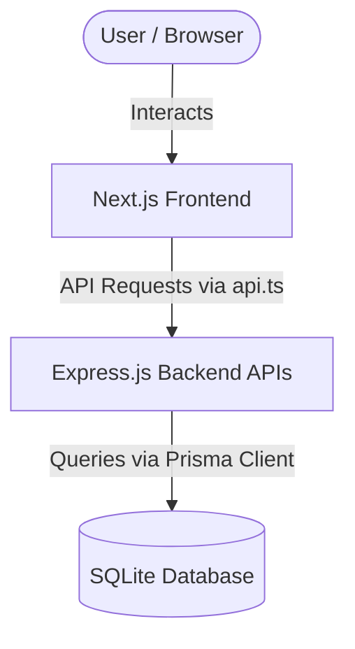

---

## Core Features Supported By This Stack

- NGO Campaign Management
- Donation System
- Volunteer Registration
- Admin Dashboard
- Blog & News Management
- Real-time Updates
- Secure Authentication
- SEO Optimization
- Accessibility Support
- Media Gallery
- Analytics Dashboard
- Performance Monitoring

---

## Development Philosophy

This technology stack is designed to provide:

- High Performance
- Modern Scalable Architecture
- Strong Security
- Accessibility Compliance
- SEO Optimization
- Smooth User Experience
- Clean Developer Workflow
- Long-Term Maintainability

The architecture balances startup-level scalability with NGO-focused usability and transparency.

---

# Platform Vision

Youth-Sakti-Social-Foundation is not just an NGO website.

It is designed as a modern NGO Ecosystem Platform that connects:

- Volunteers
- Donors
- NGOs
- Administrators
- Communities

through a centralized digital platform focused on:

- Social impact
- Transparency
- Community engagement
- Event management
- Donation systems
- Real-time participation

---

# Main Product Goals

| Goal | Purpose |
|---|---|
| Community Building | Connect volunteers and NGOs |
| Transparency | Public trust through reports and analytics |
| Donation Management | Seamless event-based donations |
| Event Coordination | Organize NGO activities efficiently |
| Awareness | Showcase ongoing social impact |
| Scalability | Future-ready architecture |
| Accessibility | Inclusive platform design |
| Performance | Fast and responsive user experience |

---

# Core Platform Philosophy

```txt
Frontend = Experience
Backend = Support System
```

The platform follows a:

- Frontend-first architecture
- Serverless-first mindset
- Minimal backend complexity
- Scalable managed-service ecosystem

---

# Complete System Architecture

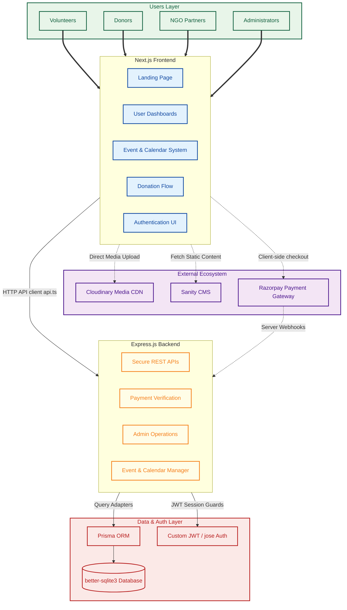

---

# User Roles Architecture

## Platform Roles

| Role | Responsibilities |
|---|---|
| Volunteer | Participate in NGO events |
| Donor | Donate to campaigns/events |
| NGO Partner | Organize and manage NGO events |
| Admin | Platform management and moderation |

---

# Authentication Flow

## Authentication Providers

| Method | Usage |
|---|---|
| Google OAuth | Fast onboarding |
| Email OTP | Passwordless authentication |

---

## Authentication Pipeline

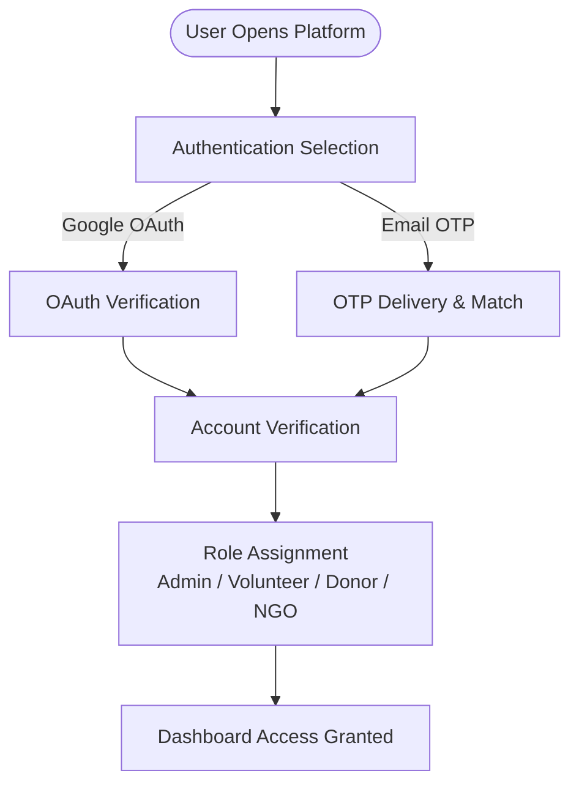

---

# Landing Page Flow

## Landing Page Purpose

The landing page is designed to:

- Build trust
- Showcase impact
- Encourage participation
- Increase donations
- Improve community engagement

---

# Landing Page Sections

| Section | Purpose |
|---|---|
| Hero Section | Emotional storytelling |
| NGO Mission | Introduce organization |
| Live Statistics | Build transparency |
| Active Campaigns | Increase participation |
| Upcoming Events | Event awareness |
| Testimonials | Build trust |
| Volunteer CTA | Community growth |
| Donation CTA | Fundraising |
| Footer | Contact + Legal |

---

# Volunteer & Donor Flow

# Volunteer Dashboard Features

| Feature | Description |
|---|---|
| Event Discovery | Browse NGO events |
| Calendar System | View upcoming schedules |
| Event Participation | Register for activities |
| Donation System | Support campaigns financially |
| Community Interaction | Like/comment on posts |
| Participation Tracking | View contribution history |

---

# Volunteer Participation Flow

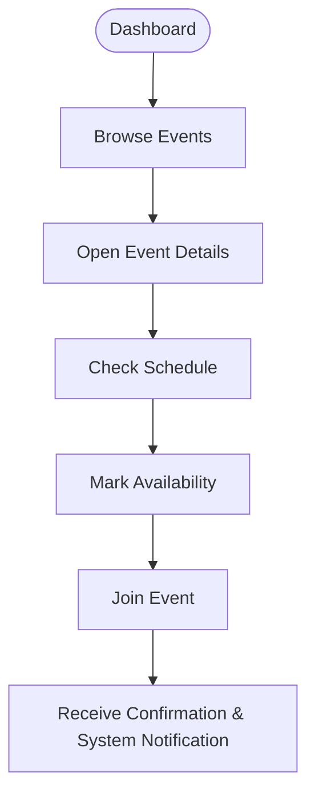

---

# Donation Workflow

## Event Donation Pipeline

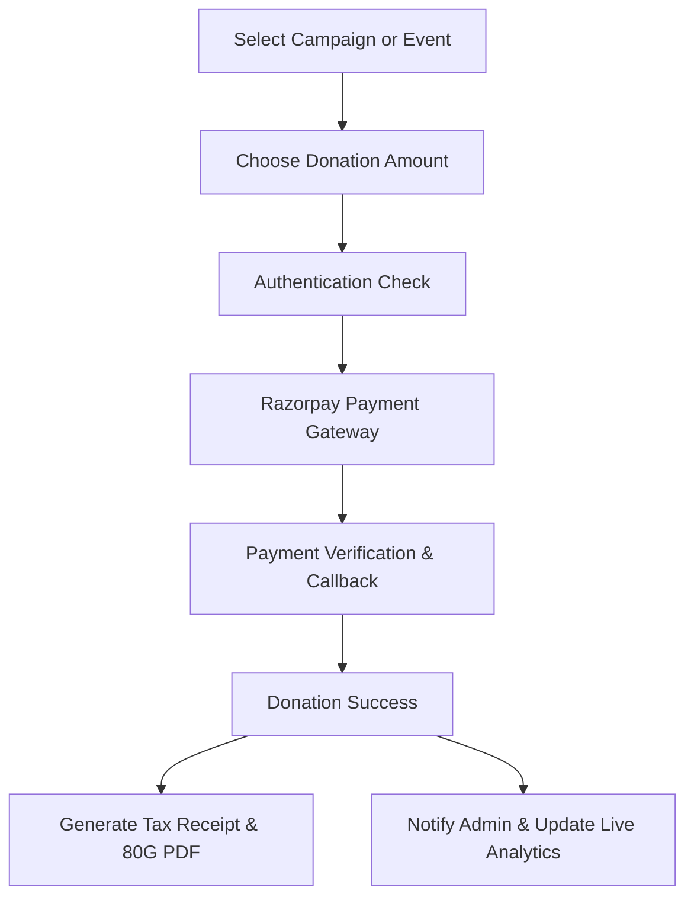

---

# Blood Donation Event Flow

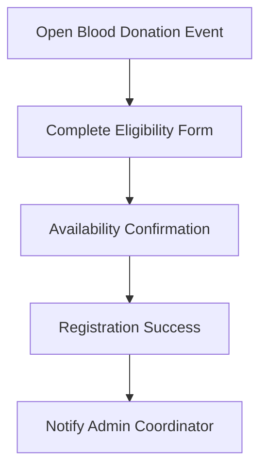

---

# NGO Partner Workflow

## NGO Dashboard Features

| Feature | Description |
|---|---|
| Create Events | Organize NGO campaigns |
| Manage Volunteers | Community coordination |
| Upload Reports | Transparency system |
| Schedule Programs | Calendar integration |
| Donation Requests | Event fundraising |
| Analytics | Event performance |

---

## NGO Event Creation Flow

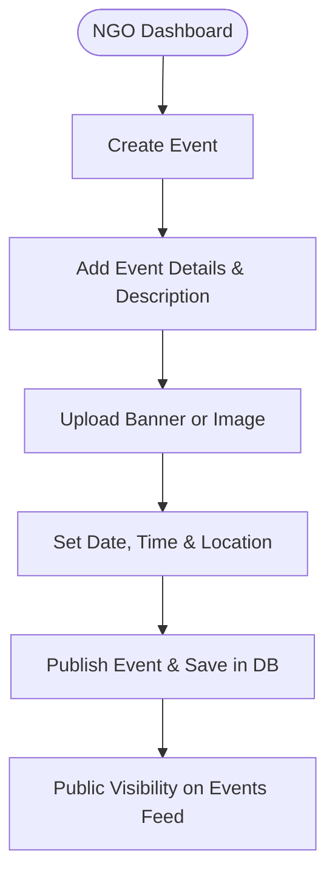

---

# Admin Workflow

# Admin Dashboard Features

| Feature | Description |
|---|---|
| User Management | Manage volunteers/donors |
| NGO Verification | Approve NGO registrations |
| Event Management | Edit/remove campaigns |
| Donation Monitoring | Financial tracking |
| Content Moderation | Manage community interactions |
| Analytics Dashboard | Platform insights |
| Calendar Management | Global scheduling |

---

## Admin Control Pipeline

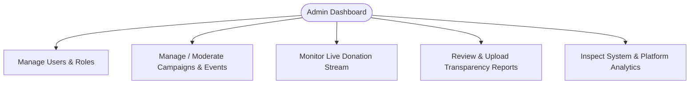

---

# Calendar System

## Calendar Features

| Feature | Description |
|---|---|
| Upcoming NGO Events | Social campaigns |
| Volunteer Scheduling | Participation planning |
| Holiday Management | Event organization |
| Blood Donation Camps | Awareness programs |
| Fundraising Drives | Donation schedules |

---

## Calendar Interaction Flow

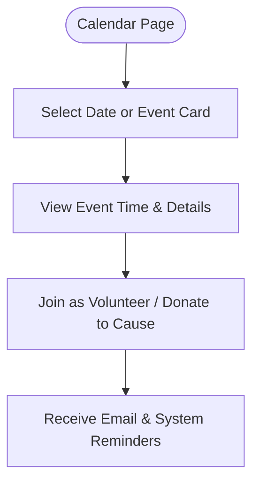

---

# Notification System

## Notification Categories

| Notification | Example |
|---|---|
| Event Reminder | Upcoming volunteer activity |
| Donation Success | Payment confirmation |
| NGO Update | New campaign added |
| Participation Approval | Volunteer confirmation |
| Campaign Milestone | Donation goal achieved |

---

# Transparency Dashboard

## Transparency Goals

The platform prioritizes:

- Public trust
- Financial transparency
- NGO accountability
- Real-time impact tracking

---

# Transparency Features

| Feature | Purpose |
|---|---|
| Donation Statistics | Public accountability |
| Event Reports | Transparency |
| Volunteer Metrics | Community trust |
| Fund Allocation Charts | Financial clarity |
| Campaign Progress | Real-time updates |

---

# Frontend Design Philosophy

## UI/UX Goals

| Goal | Purpose |
|---|---|
| Emotional Storytelling | Human-centered experience |
| Smooth Animations | Modern interaction |
| Accessibility | Inclusive design |
| Performance | Fast loading |
| Mobile Responsiveness | Multi-device support |
| Minimal UI | Clean user experience |

---

# Frontend Technology Pipeline

```txt
Next.js
   ↓
React Components
   ↓
Tailwind CSS Styling
   ↓
Framer Motion Animations
   ↓
Three.js Interactive Experience
   ↓
Optimized User Experience
```

---

# Database Design Overview

## Main Collections / Tables

| Table | Purpose |
|---|---|
| users | User accounts |
| roles | Permission management |
| ngos | NGO organization data |
| events | Campaign/event management |
| donations | Financial tracking |
| volunteers | Participation records |
| comments | Community interaction |
| notifications | System alerts |
| reports | Transparency reports |

---

# Security Architecture

## Security Features

| Feature | Purpose |
|---|---|
| Supabase Auth | Secure authentication |
| Row Level Security | Permission control |
| JWT Sessions | Secure access |
| Protected Routes | Dashboard security |
| Environment Variables | Secret protection |

---

# Performance Optimization

## Optimization Strategy

| Feature | Purpose |
|---|---|
| Lazy Loading | Faster page rendering |
| Image Optimization | Reduced load times |
| CDN Delivery | Faster media serving |
| SSR/SSG | SEO + performance |
| Code Splitting | Better scalability |

---

# Analytics & Monitoring

## Monitoring Stack

| Tool | Purpose |
|---|---|
| Sentry | Error tracking |
| PostHog | User analytics |
| Vercel Analytics | Performance monitoring |

---

# Development Phases

# Phase 1 — MVP

## Features

- Landing Page
- Authentication
- Event System
- Donation Flow
- Calendar System
- Admin Dashboard
- Posting System

---

# Phase 2 — Community Features

## Features

- Likes & Comments
- NGO Partnerships
- Volunteer Tracking
- Notifications
- Media Gallery

---

# Phase 3 — Advanced Features

## Features

- Transparency Dashboard
- Advanced Analytics
- AI Recommendations
- Realtime Collaboration
- Smart Notifications

---

# Suggested Folder Structure

```txt
src/
│
├── app/
├── components/
├── features/
├── hooks/
├── lib/
├── services/
├── store/
├── types/
├── utils/
├── styles/
├── server/
└── prisma/
```

---

# State Management Architecture

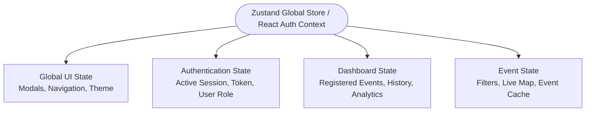

---

# Deployment Pipeline

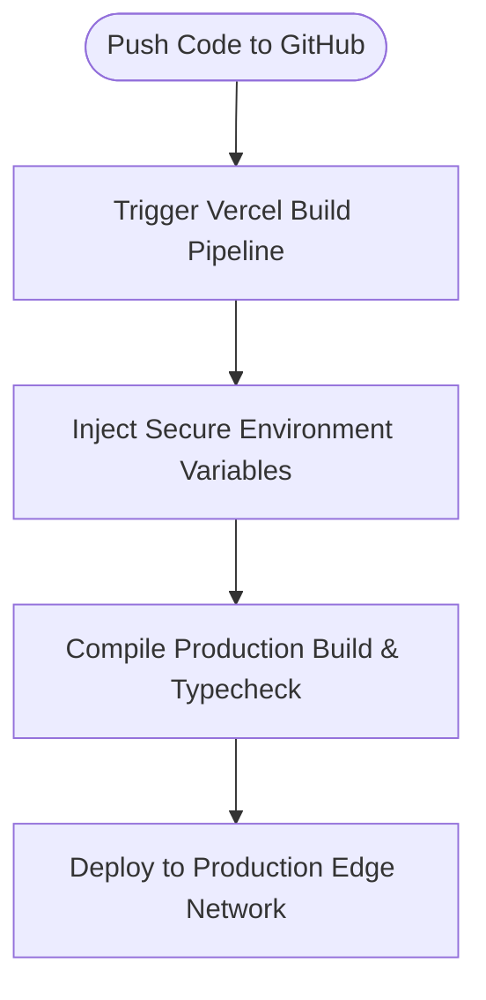

---

# Future Scalability Vision

## Future Possibilities

- AI-powered NGO recommendations
- Realtime volunteer coordination
- Mobile application
- Multi-language support
- NGO verification system
- Blockchain transparency logs
- Live donation tracking
- AI chatbot assistant

---

# Final Product Vision

Youth-Sakti-Social-Foundation aims to become:

```txt
A scalable NGO collaboration and social impact ecosystem
focused on transparency, participation, and community-driven change.
```

---

# Core Values

- Transparency
- Accessibility
- Community
- Scalability
- Inclusivity
- Social Impact
- Trust
- Modern User Experience
